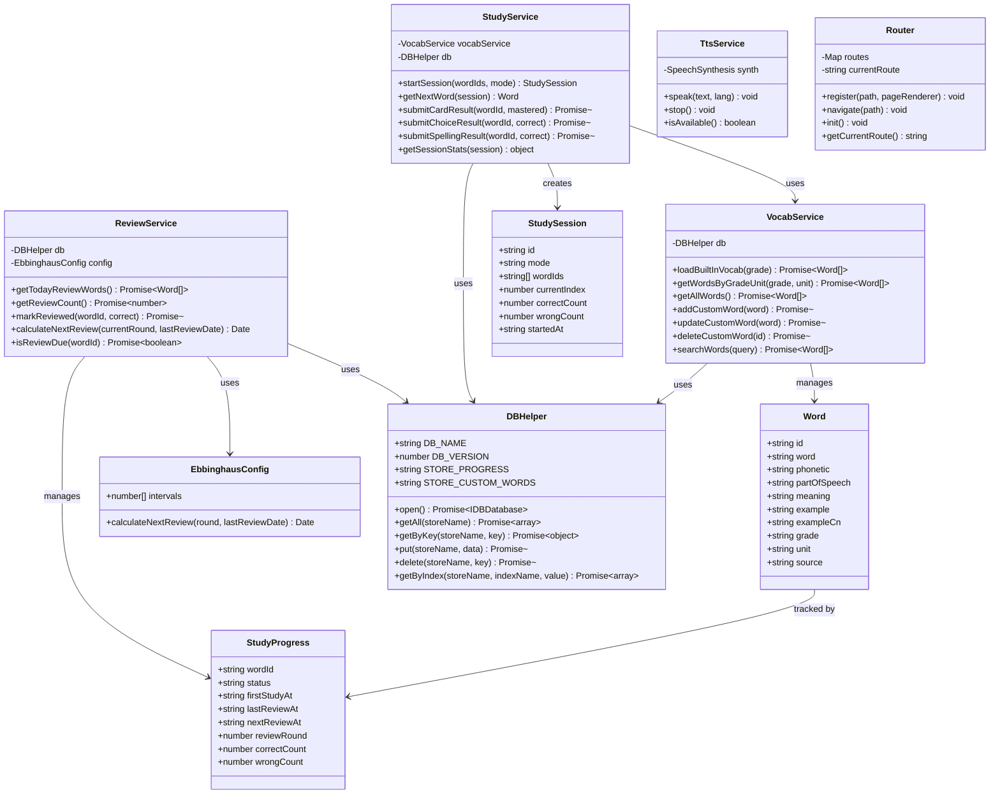
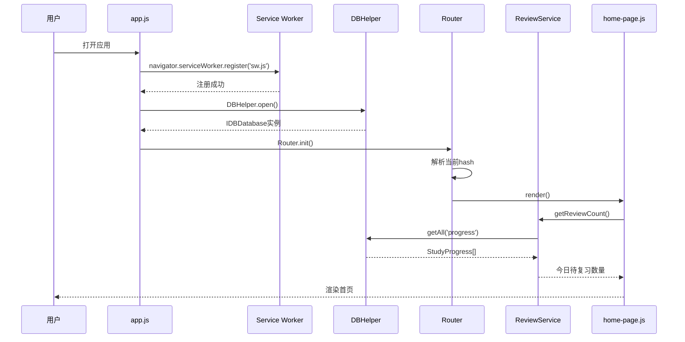
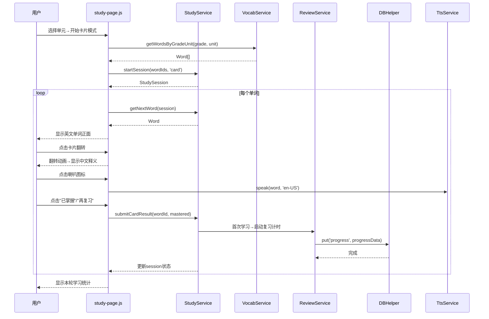
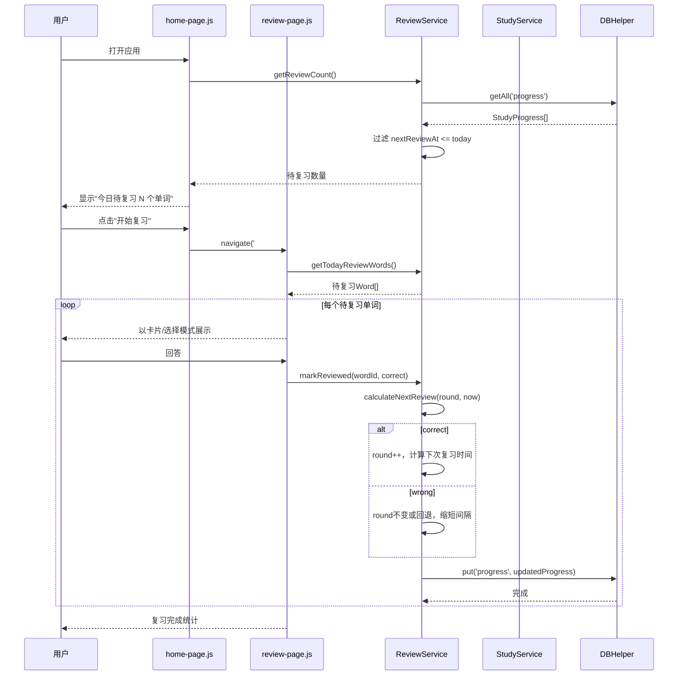
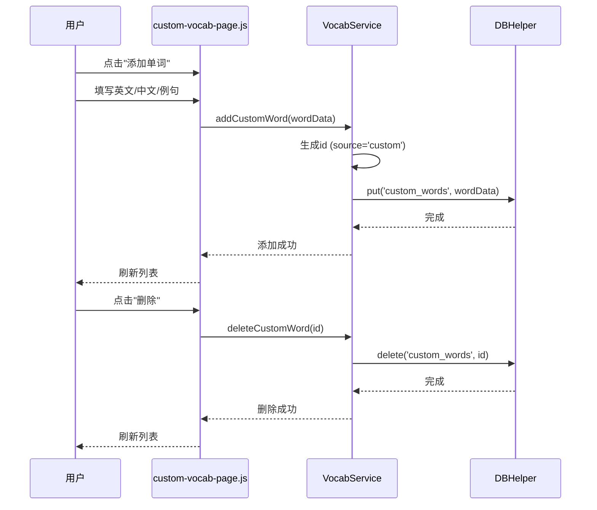

# 系统架构设计：小学生英语单词背诵应用（PWA）

## 1. 实现方案 + 框架选型

### 1.1 整体架构

采用 **纯前端 PWA 单页应用（SPA）** 架构，无后端依赖，所有数据和逻辑均在客户端运行。

架构分层：

```
┌─────────────────────────────────────────────────┐
│                  表现层 (UI Layer)                │
│  index.html + CSS 动画 + 卡通风格组件             │
├─────────────────────────────────────────────────┤
│                  路由层 (Router)                   │
│  基于hash的轻量路由，管理页面切换                    │
├─────────────────────────────────────────────────┤
│                  业务逻辑层 (Services)             │
│  StudyService / ReviewService / TtsService / ...  │
├─────────────────────────────────────────────────┤
│                  数据访问层 (Repository)           │
│  VocabRepository (IndexedDB) / ProgressRepository │
├─────────────────────────────────────────────────┤
│                  基础设施层 (Infrastructure)       │
│  IndexedDB / Service Worker / Web Speech API      │
└─────────────────────────────────────────────────┘
```

### 1.2 核心技术挑战与方案

| 挑战 | 方案 |
|------|------|
| 无框架条件下的SPA路由 | 基于hash（`#/page`）的自定义路由器，动态渲染页面容器内容 |
| 离线可用 | Service Worker + Cache API，缓存所有静态资源和词库JSON |
| 学习进度持久化 | IndexedDB（异步API，支持结构化存储和索引查询） |
| TTS发音 | Web Speech API（SpeechSynthesis），不支持时优雅降级隐藏发音按钮 |
| 艾宾浩斯复习调度 | 纯JS实现的复习计算引擎，固定间隔序列 |
| 卡片翻转动画 | CSS 3D Transform（perspective + rotateY） |
| 自定义词库 | IndexedDB存储，与内置词库统一数据结构，通过`source`字段区分 |

### 1.3 不使用的框架（及原因）

- **不使用 React/Vue**：技术约束要求原生JS，减少构建依赖
- **不使用构建工具**：直接浏览器加载，Service Worker缓存即可
- **不使用 npm**：纯静态文件部署，无需包管理

---

## 2. 文件列表及相对路径

```
vocab_app/
├── index.html                          # 应用入口（SPA壳）
├── manifest.json                       # PWA清单文件
├── sw.js                               # Service Worker
├── css/
│   ├── base.css                        # 基础样式（重置、变量、字体、通用）
│   ├── components.css                  # 组件样式（按钮、卡片、输入框等）
│   ├── pages.css                       # 页面布局样式
│   └── animations.css                  # 动画样式（翻转、庆祝、过渡）
├── js/
│   ├── app.js                          # 应用入口：初始化路由、数据库、SW注册
│   ├── router.js                       # Hash路由器
│   ├── db.js                           # IndexedDB封装（数据库初始化、CRUD操作）
│   ├── services/
│   │   ├── study-service.js            # 背诵逻辑（卡片/选择/拼写三种模式）
│   │   ├── review-service.js           # 艾宾浩斯复习调度引擎
│   │   ├── tts-service.js              # TTS发音服务
│   │   └── vocab-service.js            # 词库管理（内置+自定义CRUD）
│   ├── pages/
│   │   ├── home-page.js                # 首页（今日待复习、词库入口）
│   │   ├── vocab-browser-page.js       # 词库浏览页（年级→单元层级）
│   │   ├── study-page.js               # 背诵页（三种模式切换）
│   │   ├── review-page.js              # 复习页（待复习单词列表+复习流程）
│   │   ├── word-detail-page.js         # 单词详情页
│   │   └── custom-vocab-page.js        # 自定义词库管理页
│   └── utils/
│       └── helpers.js                  # 工具函数（日期计算、随机抽取等）
├── data/
│   ├── grade3.json                     # 3年级词库
│   ├── grade4.json                     # 4年级词库
│   ├── grade5.json                     # 5年级词库
│   └── grade6.json                     # 6年级词库
├── icons/
│   ├── icon-192.png                    # PWA图标192x192
│   └── icon-512.png                    # PWA图标512x512
└── docs/
    ├── ARCHITECTURE.md                 # 本文档
    ├── sequence-diagram.mermaid        # 时序图
    └── class-diagram.mermaid           # 类图
```

---

## 3. 数据结构和接口（类图）



---

## 4. 程序调用流程（时序图）

### 4.1 应用启动流程



### 4.2 卡片背诵流程



### 4.3 艾宾浩斯复习流程



### 4.4 自定义词库管理流程



---

## 5. 任务列表

### T01: 项目基础设施

**描述**：创建项目骨架，包括入口HTML、PWA配置、Service Worker、基础CSS框架和JS入口模块。搭建应用运行的基础环境。

**依赖**：无

**优先级**：P0

**涉及文件**：
- `index.html` — SPA入口，引入所有CSS和JS，定义页面容器
- `manifest.json` — PWA清单（name、icons、theme_color、display等）
- `sw.js` — Service Worker（缓存策略：Cache First for 静态资源）
- `css/base.css` — CSS变量（主题色、字体）、CSS Reset、通用样式
- `css/components.css` — 通用组件样式（按钮、卡片、输入框、弹窗、导航栏）
- `css/animations.css` — 动画定义（翻转、星星飘落、淡入淡出）
- `js/app.js` — 应用入口（注册SW、初始化DB、启动路由）
- `js/router.js` — Hash路由器实现（register/navigate/init）
- `css/pages.css` — 页面布局通用样式（容器、间距等）

---

### T02: 数据层 + 词库数据

**描述**：实现IndexedDB数据访问封装、内置词库JSON数据文件、词库管理服务和艾宾浩斯复习调度引擎。

**依赖**：T01

**优先级**：P0

**涉及文件**：
- `js/db.js` — IndexedDB封装类 DBHelper（打开数据库、创建store和索引、CRUD通用方法）
- `data/grade3.json` — 3年级词库（约80个单词示例数据）
- `data/grade4.json` — 4年级词库（约80个单词示例数据）
- `data/grade5.json` — 5年级词库（约80个单词示例数据）
- `data/grade6.json` — 6年级词库（约80个单词示例数据）
- `js/services/vocab-service.js` — 词库管理服务（加载内置词库、按年级单元查询、自定义词CRUD、搜索）
- `js/services/review-service.js` — 复习调度引擎（艾宾浩斯间隔计算、今日待复习查询、标记复习结果）
- `js/utils/helpers.js` — 工具函数（日期格式化、随机数组抽取、UUID生成）

---

### T03: 核心背诵功能 + 学习服务

**描述**：实现三种背诵模式（卡片、选择题、拼写）的核心逻辑和TTS发音服务，以及背诵页面UI。

**依赖**：T02

**优先级**：P0

**涉及文件**：
- `js/services/study-service.js` — 背诵会话管理（创建session、获取下一个单词、提交结果、统计）
- `js/services/tts-service.js` — TTS发音服务（speak/stop/isAvailable，优雅降级处理）
- `js/pages/study-page.js` — 背诵页面（三种模式切换、卡片翻转交互、选择题交互、拼写输入交互、实时提示、结果提交、学习统计展示）

---

### T04: 页面组件 + 自定义词库

**描述**：实现首页、词库浏览页、复习页、单词详情页、自定义词库管理页等所有剩余页面。

**依赖**：T03

**优先级**：P0

**涉及文件**：
- `js/pages/home-page.js` — 首页（今日待复习数量展示、词库入口、开始背诵快捷入口）
- `js/pages/vocab-browser-page.js` — 词库浏览页（年级→单元层级导航、单词列表展示）
- `js/pages/review-page.js` — 复习页（待复习单词队列、复习流程、完成统计）
- `js/pages/word-detail-page.js` — 单词详情页（音标、词性、释义、例句、TTS朗读）
- `js/pages/custom-vocab-page.js` — 自定义词库管理页（添加/编辑/删除自定义单词表单和列表）

---

### T05: 路由集成 + PWA完善 + 最终调试

**描述**：将所有页面注册到路由器，集成端到端流程，完善PWA离线体验，确保所有功能正常串联。

**依赖**：T04

**优先级**：P0

**涉及文件**：
- `js/app.js` — 注册所有路由、完善初始化流程（修改已有文件）
- `sw.js` — 完善缓存策略、添加词库JSON预缓存（修改已有文件）
- `index.html` — 确认所有JS/CSS引用完整（修改已有文件）
- `icons/icon-192.png` — PWA图标占位（可后续替换）
- `icons/icon-512.png` — PWA图标占位（可后续替换）

---

## 6. 依赖包列表

本项目不使用 npm 包，依赖以下 Web API 和浏览器原生能力：

| API | 用途 | 兼容性说明 |
|-----|------|-----------|
| **IndexedDB** | 学习进度和自定义词库持久化存储 | 主流浏览器均支持 |
| **Service Worker API** | 离线缓存，PWA核心 | 需HTTPS或localhost |
| **Cache API** | 静态资源和词库缓存 | 与Service Worker配合使用 |
| **Web Speech API (SpeechSynthesis)** | 单词和例句TTS发音 | Chrome/Edge支持良好，部分设备离线不可用 |
| **Hash Change Event** | SPA路由监听 | 所有浏览器支持 |
| **CSS 3D Transforms** | 卡片翻转动画 | 现代浏览器均支持 |
| **CSS Custom Properties** | 主题变量、响应式设计 | IE不支持，目标平台无此问题 |
| **localStorage** | 简单配置项存储（如深色模式偏好） | 所有浏览器支持 |
| **Fetch API** | 加载词库JSON文件 | 所有现代浏览器支持 |

---

## 7. 共享知识

### 7.1 数据格式约定

- **所有时间字段**使用 ISO 8601 UTC 字符串格式：`new Date().toISOString()`
- **单词ID**格式：内置词库为 `g{grade}_u{unit}_{index}`（如 `g3_u1_05`），自定义词库为 `custom_{timestamp}_{random}`
- **学习状态枚举**：`new` | `learning` | `mastered`
- **背诵模式枚举**：`card` | `choice` | `spelling`

### 7.2 IndexedDB 数据库设计

- **数据库名称**：`VocabAppDB`
- **版本号**：1
- **Object Store：progress**
  - 主键：`wordId`
  - 索引：`status`、`nextReviewAt`、`source`
- **Object Store：custom_words**
  - 主键：`id`
  - 索引：`grade`、`unit`

### 7.3 词库JSON格式

```json
{
  "grade": "3",
  "units": [
    {
      "unit": "1",
      "title": "Hello!",
      "words": [
        {
          "id": "g3_u1_01",
          "word": "hello",
          "phonetic": "/həˈloʊ/",
          "partOfSpeech": "interj.",
          "meaning": "你好",
          "example": "Hello, how are you?",
          "exampleCn": "你好，你好吗？"
        }
      ]
    }
  ]
}
```

### 7.4 命名规范

- **CSS类名**：BEM命名 `block__element--modifier`（如 `card__front--flipped`）
- **JS模块**：每个文件一个模块，使用IIFE或ES Module（`type="module"`）
- **事件命名**：自定义事件使用 `vocabapp:action` 格式（如 `vocabapp:review-complete`）
- **Hash路由**：格式 `#/pageName?key=value`（如 `#/study?grade=3&unit=1&mode=card`）

### 7.5 艾宾浩斯复习间隔

```javascript
const REVIEW_INTERVALS = [1, 2, 4, 7, 15, 30]; // 天数
// 第0轮学完 → 1天后复习（第1轮）
// 第1轮复习完 → 2天后复习（第2轮）
// ...依次类推
// 第5轮复习完 → 标记为mastered（或继续30天循环）
```

### 7.6 错误处理

- IndexedDB操作统一用 try-catch 包裹，错误输出到 console.error
- TTS不可用时隐藏发音按钮，不阻断其他功能
- 词库加载失败时显示友好的错误提示页面

---

## 8. 待明确事项

1. **TTS离线降级**：Web Speech API在部分安卓WebView中离线不可用。当前方案为优雅降级（隐藏发音按钮），如果需要离线发音，需预置音频文件，会显著增加包体积。建议MVP阶段不预置音频。
2. **词库数据版权**：译林版教材单词列表的版权归属未确认。建议内置词库使用公开可用的基础单词释义，例句自行编写以避免版权问题。
3. **APK打包方案**：PRD中P2-1提到APK打包，建议使用Capacitor方案（更灵活，不依赖PWA可安装性检测）。具体实现不在当前架构范围内，但文件结构已兼容。
4. **遗忘曲线动态调整**：当前使用固定间隔序列。如需根据用户表现动态调整（如SM-2算法），可在ReviewService中替换计算逻辑，不影响其他模块。
5. **多用户支持**：当前为单用户本地应用。如需多子女使用，需增加用户切换功能，IndexedDB需增加user store。建议作为后续迭代。
6. **词库数据量**：3-6年级约320个单词，词库JSON文件总体积预计不超过100KB，Service Worker缓存无压力。
